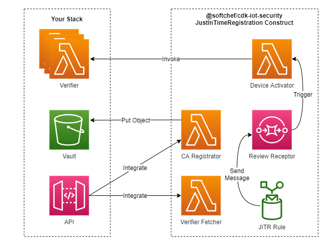
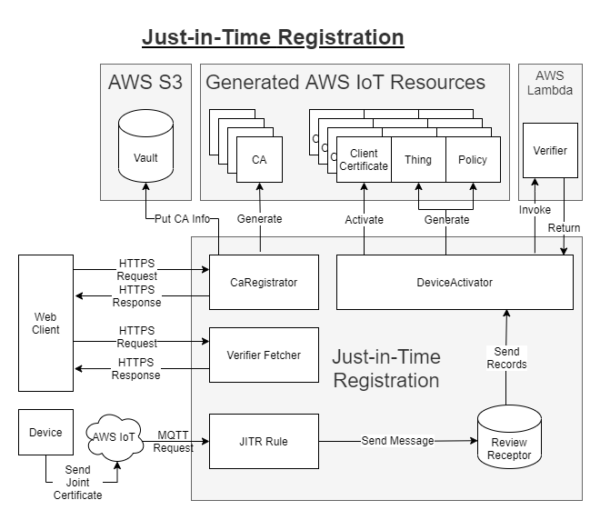

# CDK Construct - IoT Security

`cdk-iot-security` is a project surrounding the topic of the AWS IoT Device registration. In order to utilize the AWS IoT services securely, we might need to maintain our own certificate authorities, as known as CAs, and manage the CA-signed device certificates. AWS IoT holds an organized architecture for works mentioned previously, allows us to register multiple CA and certificates to it, and provides APIs for fetching information supporting our management. This project focuses on the autherization work flows of AWS IoT, plans to provide CDK constructs which satisfy the requirements of [Just-in-time registration](https://aws.amazon.com/tw/blogs/iot/just-in-time-registration-of-device-certificates-on-aws-iot/), and also the Construct for [Just-in-time provisioning](https://aws.amazon.com/tw/blogs/iot/setting-up-just-in-time-provisioning-with-aws-iot-core/).

## Installation

### NPM

    npm install @softchef/cdk-iot-security

### Yarn

    yarn add @softchef/cdk-iot-security
    

## Just-in-Time Registration

### Usage

    import { JustInTimeRegistration } from '@softchef/cdk-iot-security';
    import * as cdk from '@aws-cdk/core';
    import * as s3 from '@aws-cdk/aws-s3';
    import * as lambda from '@aws-cdk/aws-lambda';

    const app = new cdk.App();
    const id = 'JitrDemo';
    const stack = new cdk.Stack(app, id);
    const anotherStack = new cdk.Stack(app, 'anotherStack');
    new JustInTimeRegistration(stack, id, {
        vault: {
            bucket: new s3.Bucket(anotherStack, 'myVault2'),
            prefix: 'my/ca/path',
        },
        verifiers: [
            new lambda.Function(anotherStack, 'verifier1', {
                code: lambda.Code.fromInline('exports.handler = async (_event) => { return JSON.stringify({ verified: true }); }'),
                handler: 'handler',
                runtime: lambda.Runtime.NODEJS_12_X,
            }),
            new lambda.Function(anotherStack, 'verifier2', {
                code: lambda.Code.fromInline('exports.handler = async (event) => { return JSON.stringify({ verified: event? true : false }); }'),
                handler: 'handler',
                runtime: lambda.Runtime.NODEJS_12_X,
            })
        ]
    });

## Just-in-Time Provision

JITP work flow is usually applied in a situation that the device is not able to generate their own certificate. The senario would probably like the following: the service provider deploy the JITP construct and provide the API; an user client get the generated device certificate through the API; the user client pass the device certificate to the device; the device connect to the AWS IoT through MQTT connection. Finally, the AWS IoT JITP service will be triggered and provision the expected resources.

### Usage

#### Initialize Construct

    import { JustInTimeProvision } from '@softchef/cdk-iot-security';
    import { Bucket } from '@aws-cdk/aws-s3';
    import * as cdk from '@aws-cdk/core';

    const app = new cdk.App();
    const id = 'JitpDemo';
    const stack = new cdk.Stack(app, id);
    const justInTimeProvision = new JustInTimeProvision(stack, id, {
        vault: {
            bucket: new Bucket(stack, 'myVault'),
        },
        verifiers: [
            new lambda.Function(anotherStack, 'verifier1', {
                code: lambda.Code.fromInline('exports.handler = async (_event) => { return JSON.stringify({ verified: true }); }'),
                handler: 'handler',
                runtime: lambda.Runtime.NODEJS_12_X,
            }),
            new lambda.Function(anotherStack, 'verifier2', {
                code: lambda.Code.fromInline('exports.handler = async (event) => { return JSON.stringify({ verified: event? true : false }); }'),
                handler: 'handler',
                runtime: lambda.Runtime.NODEJS_12_X,
            })
        ],
    });

#### Calling the CA Registrator

CA Registrator assumes receiving an event object with the following format:

    event = {
        ...
        "body": {
            "csrSubjects": {
                "commonName": "myName",
                "countryName": "TW",
                "stateName": "TP",
                "localityName": "TW",
                "organizationName": "Soft Chef",
                "organizationUnitName": "web"
            },
            "verifierName": "verifier_name",
            "templateBody": "{ \"Parameters\" : { \"AWS::IoT::Certificate::Country\" : { \"Type\" : \"String\" }, \"AWS::IoT::Certificate::Id\" : { \"Type\" : \"String\" } }, \"Resources\" : { \"thing\" : { \"Type\" : \"AWS::IoT::Thing\", \"Properties\" : { \"ThingName\" : {\"Ref\" : \"AWS::IoT::Certificate::Id\"}, \"AttributePayload\" : { \"version\" : \"v1\", \"country\" : {\"Ref\" : \"AWS::IoT::Certificate::Country\"}} } }, \"certificate\" : { \"Type\" : \"AWS::IoT::Certificate\", \"Properties\" : { \"CertificateId\": {\"Ref\" : \"AWS::IoT::Certificate::Id\"}, \"Status\" : \"ACTIVE\" } }, \"policy\" : {\"Type\" : \"AWS::IoT::Policy\", \"Properties\" : { \"PolicyDocument\" : \"{\\\"Version\\\": \\\"2012-10-17\\\",\\\"Statement\\\": [{\\\"Effect\\\":\\\"Allow\\\",\\\"Action\\\": [\\\"iot:Connect\\\",\\\"iot:Publish\\\"],\\\"Resource\\\" : [\\\"*\\\"]}]}\" } } } }"
            }
        }
    }

Since the event is mainly a HTTP POST request, it has a body section containing attached information. The body consist of three parts, CSR subjects, verifier name, and template body.

* CSR subjects define the information to fill up the subject fields of the CA certificate. CSR subjects are optional. If some of the fields are leaved blank, those fields will be fill up with empty string. Mandated by the AWS, the common name field would be replaced by the registration code, thus is unnecessary.

* Verifier name specifies the verifier applied in the device verification. Verifier name is Optional.

* Template body is a string defining the resources provisioned for the device. Template body is Optional. If no template body being specified, a default template body will be applied. See more information from [here](https://docs.aws.amazon.com/iot/latest/developerguide/jit-provisioning.html).

#### Calling the Device Certificate Generator

Device Certificate Generator assumes receiving an event object with the following format:

    event = {
        ...
        body: {
            "caCertificateId": "myCaCertificateId",
            "thingName": "myThingName",
            "deviceInfo": {
                ...
            },
        }        
    }

Since the event is mainly a HTTP POST request, it has a body section containing attached information. The body consist of three parts, CA certificate ID, thing name, and device information.

* CA certificate ID is the ID of the CA created by the CA Registrator. CA certificate ID is required by the Device Certificate Generator. The CA will authenticate the device certificate.

* Thing name is the desirable name you give to the AWS IoT thing provisioned for the device certificate. Thing name is optional. If no thing name is specified, the thing name would be a UUID.

* Device information is the information provided by the device for verification. Whether it is required or not and its form depends on your configuration of the verifiers.

#### Calling the Verifiers Fetcher

Verifiers Fetcher assumes receiving an event object with the following format:

    event = {
        ...
        body: {}
    }

Since the event is mainly a HTTP GET request, no body content is expected. However, no matter what the request content is, the Verifiers Fetcher always return all the verifiers' name.

## Examples

* JITR

* [JITP](./src/demo/jitp/README.md)

* Fleet-Provisioning

## Roadmap

### JITP

* Verify which user is calling the device certificate generator API.

* Manage the thing name and user relationship.
