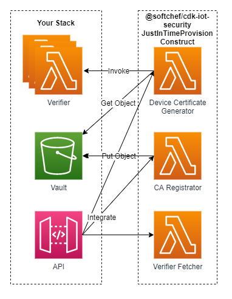
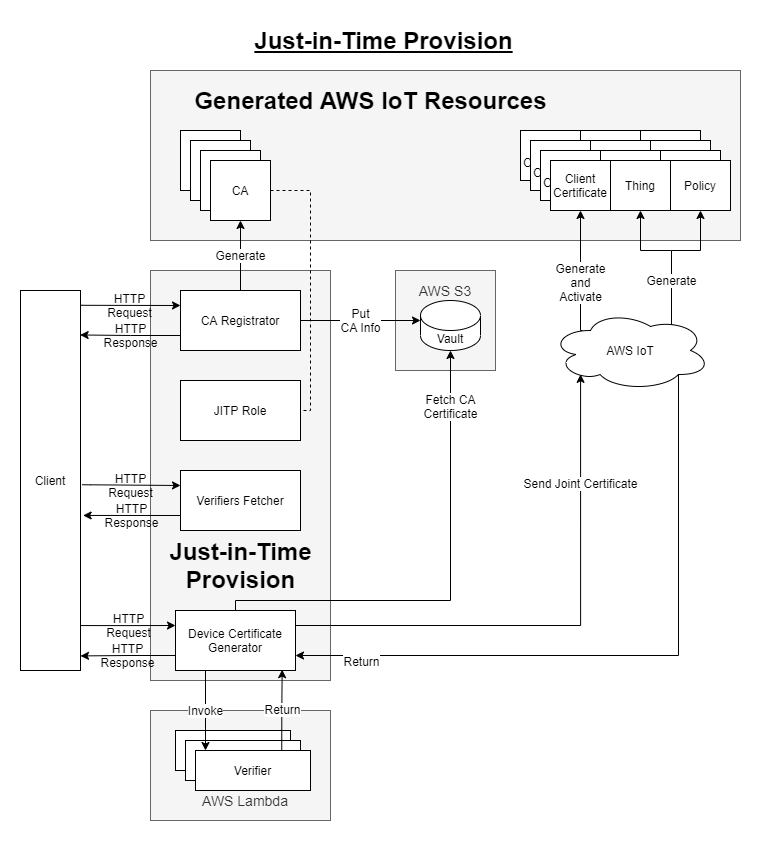
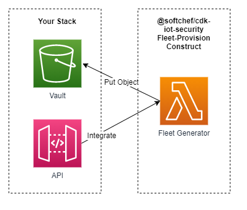
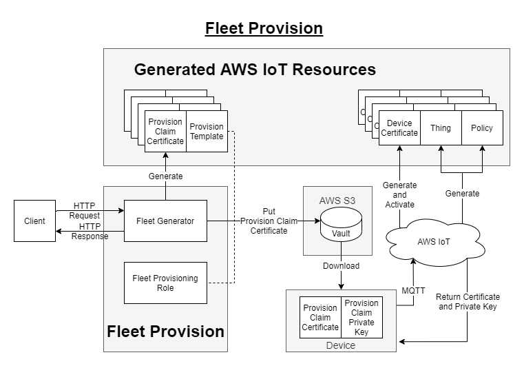

# CDK Construct - IoT Security

[](https://badge.fury.io/js/%40softchef%2Fcdk-restapi)


```cdk-iot-security``` is a project surrounding the topic of the AWS IoT Device registration. In order to utilize the AWS IoT services securely, we might need to maintain our device certificates and the relative resources. AWS IoT holds an organized architecture allowing us to register multiple certificates to it, and provides APIs for fetching information supporting our management. This project focuses on the autherization work flows of AWS IoT, provides CDK constructs which satisfy the requirements of [Just-in-time registration](https://aws.amazon.com/tw/blogs/iot/just-in-time-registration-of-device-certificates-on-aws-iot/), [Just-in-time provisioning](https://aws.amazon.com/tw/blogs/iot/setting-up-just-in-time-provisioning-with-aws-iot-core/), and [Fleet-provisioning](https://docs.aws.amazon.com/iot/latest/developerguide/provision-wo-cert.html). Utilizing ```cdk-iot-security```, you do not need to implement the resource provisioning flow by yourself, and can focus on other functionalities of your IoT products.

## Installation

### NPM

    npm install @softchef/cdk-iot-security

### Yarn

    yarn add @softchef/cdk-iot-security

## Examples

* [JITR](./src/demo/jitr/README.md)

* [JITP](./src/demo/jitp/README.md)

* [Fleet-Provisioning](./src/demo/fleet-provision/README.md)

## Just-in-Time Registration

JITR work flow is usually applied in a situation that the devices are able to generate their own certificates. The scenario would probably like the following: the service provider deploy the JITR construct; the service provider create registered CA; the service provider make a copy of the CA certificate on a device and provide the device for the user client; an user client turn on the device and the device generate its certificate; the device connect to the AWS IoT through MQTT connection. The AWS IoT JITR service will be triggered and the JITR MQTT message will be passed through the topic rule, the SQS queue, eventually reach the Device Activator. Finally, the Device Activator verifies and activates the device certificate, and provision the AWS IoT resources for the device certificate.

### Structure


#### Endogenous Components

##### Device Activator

The NodeJS Lambda Function with the functionality of activating a device certificate requesting for JITR.

##### CA Registrator

The NodeJS Lambda Function with the functionality of registering a CA certificate on AWS IoT.

##### Verifiers Fetcher

The NodeJS Lambda Function with the functionality of returning the names of the verfifiers.

##### JITR Topic Rule

The AWS IoT Topic Rule with the functionality of collecting the MQTT message originating from the JITR request.

##### Review Receptor

The SQS queue with the functionality of recepting the MQTT message collected by the JITP Topic Rule and pass to the Device Activation for further review.

#### Exogenous Components

##### Vault

The S3 Bucket provided by the user for storing the created CA certificate secerts, including certificate, private key, and public key, also the CA certificate ID and ARN.

##### Verifiers

The Lambda Function provided by the user for device verification. If must return a payload with the following format:

    {
        ...
        "verified": "true", // or false
    }

If it returns ```{"verified": "true"}```, the Device Activator would complete the provision. Otherwise, the process is interrupted.

##### API

You can integrate your own API to the CA registrator and Verifiers Fetcher for utilization.

### Flow


### Usage

#### Overview

The process of applying JITR is mainly consist of the following steps:

1. Initialize the JITR construct.

2. Create CA through calling the CA Registrator.

3. Create the device certificate with the device.

4. Connect the device to the AWS IoT.

Some details informations of those three steps are discussed in the following sections. For step-by-step guide, please read the [JITR demonstration files](./src/demo/jitr/README.md).

#### Initialize the JITR Construct

    import { JustInTimeRegistration } from '@softchef/cdk-iot-security';
    import * as cdk from '@aws-cdk/core';
    import * as s3 from '@aws-cdk/aws-s3';
    import * as lambda from '@aws-cdk/aws-lambda';

    const app = new cdk.App();
    const id = 'JitrDemo';
    const stack = new cdk.Stack(app, id);
    const anotherStack = new cdk.Stack(app, 'anotherStack');
    new JustInTimeRegistration(stack, id, {
        vault: {
            bucket: new s3.Bucket(anotherStack, 'myVault2'),
            prefix: 'my/ca/path',
        },
        verifiers: [
            new lambda.Function(anotherStack, 'verifier1', {
                code: lambda.Code.fromInline('exports.handler = async (_event) => { return JSON.stringify({ verified: true }); }'),
                handler: 'handler',
                runtime: lambda.Runtime.NODEJS_12_X,
            }),
            new lambda.Function(anotherStack, 'verifier2', {
                code: lambda.Code.fromInline('exports.handler = async (event) => { return JSON.stringify({ verified: event? true : false }); }'),
                handler: 'handler',
                runtime: lambda.Runtime.NODEJS_12_X,
            })
        ]
    });

#### Call the CA Registrator

You call the CA Registrator to registrate a new CA on the AWS IoT before generating a device certificate.

CA Registrator assumes receiving an event object with the following format:

    event = {
        ...
        "body": {
            "csrSubjects": {
                "commonName": "myName",
                "countryName": "TW",
                "stateName": "TP",
                "localityName": "TW",
                "organizationName": "Soft Chef",
                "organizationUnitName": "web"
            },
            "verifierName": "verifier_name",
        }
    }

Since the event is mainly a HTTP POST request, it has a body section containing attached information. The body consist of three parts, CSR subjects, verifier name, and template body.

* CSR subjects define the information to fill up the subject fields of the CA certificate. CSR subjects are optional. If some of the fields are leaved blank, those fields will be fill up with empty string. Mandated by the AWS, the common name field would be replaced by the registration code, thus is unnecessary.

* Verifier name specifies the verifier applied in the device verification. Verifier name is Optional.

#### Call the Verifiers Fetcher

You can checkout the names of the verifiers through the Verifiers Fetcher when you forget the names.

Verifiers Fetcher assumes receiving an event object with the following format:

    event = {
        ...
        body: {}
    }

Since the event is mainly a HTTP GET request, no body content is expected. However, no matter what the request content is, the Verifiers Fetcher always return all the verifiers' name.

#### Connect the Device to the AWS IoT

To trigger the JITR and the provisioning of resources, the deivce has to send a MQTT message to the AWS IoT. You need to have the basic knowledge about the MQTT. You can complete this step with either a pure MQTT connection, or ```aws-iot-deivce-sdk```. For the former, please read [mqtt-connect.js](./src/demo/jitr/mqtt-connect.js), for the later, please read [device.js](./src/demo/jitr/device.js)

## Just-in-Time Provision

JITP work flow is usually applied in a situation that the devices are not able to generate their own certificates. The scenario would probably like the following: the service provider deploies the JITP construct and provides the API for the user client; the service provider creates registered CA; an user client get the generated device certificate through the API; the user client pass the device certificate to the device; the device connect to the AWS IoT through MQTT connection. Finally, the AWS IoT JITP service will be triggered and provision the expected resources.

### Structure



#### Endogenous Components

##### CA Registrator

The NodeJS Lambda Function with the functionality of registering a CA certificate on AWS IoT.

##### Verifiers Fetcher

The NodeJS Lambda Function with the functionality of returning the names of the verfifiers.

##### Device Certificate Generator

The NodeJS Lambda Function with the functionality of generating the device certificate.

#### Exogenous Components

##### Vault

The S3 Bucket provided by the user for storing the created CA certificate secerts, including certificate, private key, and public key, also the CA certificate ID and ARN.

##### Verifiers

The Lambda Function provided by the user for device verification. If must return a payload with the following format:

    {
        ...
        "verified": "true", // or false
    }

If it returns ```{"verified": "true"}```, the Device Certificate Generator would complete the device certificate generation. Otherwise, the process is interrupted.

##### API

You can integrate your own API to the CA registrator, Device Certificate Generator, and Verifiers Fetcher for further utilization.

### Flow



### Usage

#### Overview

The process of applying JITP is mainly consist of the following steps:

1. Initialize the JITP construct.

2. Create CA through calling the CA Registrator.

3. Create Device Certificate through calling the Device Certificate Generator.

4. Connect the device to the AWS IoT.

Some details informations of those four steps are discussed in the following sections. For step-by-step guide, please read the [JITP demonstration files](./src/demo/jitp/README.md).

#### Initialize the JITP Construct

    import { JustInTimeProvision } from '@softchef/cdk-iot-security';
    import { Bucket } from '@aws-cdk/aws-s3';
    import * as cdk from '@aws-cdk/core';

    const app = new cdk.App();
    const id = 'JitpDemo';
    const stack = new cdk.Stack(app, id);
    const justInTimeProvision = new JustInTimeProvision(stack, id, {
        vault: {
            bucket: new Bucket(stack, 'myVault'),
        },
        verifiers: [
            new lambda.Function(anotherStack, 'verifier1', {
                code: lambda.Code.fromInline('exports.handler = async (_event) => { return JSON.stringify({ verified: true }); }'),
                handler: 'handler',
                runtime: lambda.Runtime.NODEJS_12_X,
            }),
            new lambda.Function(anotherStack, 'verifier2', {
                code: lambda.Code.fromInline('exports.handler = async (event) => { return JSON.stringify({ verified: event? true : false }); }'),
                handler: 'handler',
                runtime: lambda.Runtime.NODEJS_12_X,
            })
        ],
    });

#### Call the CA Registrator

You call the CA Registrator to registrate a new CA on the AWS IoT before generating a device certificate.

CA Registrator assumes receiving an event object with the following format:

    event = {
        ...
        "body": {
            "csrSubjects": {
                "commonName": "myName",
                "countryName": "TW",
                "stateName": "TP",
                "localityName": "TW",
                "organizationName": "Soft Chef",
                "organizationUnitName": "web"
            },
            "verifierName": "verifier_name",
            "templateBody": "{ \"Parameters\" : { \"AWS::IoT::Certificate::Country\" : { \"Type\" : \"String\" }, \"AWS::IoT::Certificate::Id\" : { \"Type\" : \"String\" } }, \"Resources\" : { \"thing\" : { \"Type\" : \"AWS::IoT::Thing\", \"Properties\" : { \"ThingName\" : {\"Ref\" : \"AWS::IoT::Certificate::Id\"}, \"AttributePayload\" : { \"version\" : \"v1\", \"country\" : {\"Ref\" : \"AWS::IoT::Certificate::Country\"}} } }, \"certificate\" : { \"Type\" : \"AWS::IoT::Certificate\", \"Properties\" : { \"CertificateId\": {\"Ref\" : \"AWS::IoT::Certificate::Id\"}, \"Status\" : \"ACTIVE\" } }, \"policy\" : {\"Type\" : \"AWS::IoT::Policy\", \"Properties\" : { \"PolicyDocument\" : \"{\\\"Version\\\": \\\"2012-10-17\\\",\\\"Statement\\\": [{\\\"Effect\\\":\\\"Allow\\\",\\\"Action\\\": [\\\"iot:Connect\\\",\\\"iot:Publish\\\"],\\\"Resource\\\" : [\\\"*\\\"]}]}\" } } } }"
            }
        }
    }

Since the event is mainly a HTTP POST request, it has a body section containing attached information. The body consist of three parts, CSR subjects, verifier name, and template body.

* CSR subjects define the information to fill up the subject fields of the CA certificate. CSR subjects are optional. If some of the fields are leaved blank, those fields will be fill up with empty string. Mandated by the AWS, the common name field would be replaced by the registration code, thus is unnecessary.

* Verifier name specifies the verifier applied in the device verification. Verifier name is Optional.

* Template body is a string defining the resources provisioned for the device. Template body is Optional. If no template body being specified, a default template body will be applied. See more information about defining a template body from [here](https://docs.aws.amazon.com/iot/latest/developerguide/jit-provisioning.html).

#### Call the Device Certificate Generator

You call the Device Certificate Generator to generate a device certificate after register a CA on AWS IoT.

Device Certificate Generator assumes receiving an event object with the following format:

    event = {
        ...
        body: {
            "caCertificateId": "myCaCertificateId",
            "csrSubjects": {
                "commonName": "myThingName", // data in this field would be the thing name
                "countryName": "TW",
                "stateName": "TP",
                "localityName": "TW",
                "organizationName": "Soft Chef",
                "organizationUnitName": "web"
            },
            "deviceInfo": {
                ...
            },
        }        
    }

Since the event is mainly a HTTP POST request, it has a body section containing attached information. The body consist of three parts, CA certificate ID, CSR subjects, and device information.

* CA certificate ID is the ID of the CA created by the CA Registrator. CA certificate ID is required by the Device Certificate Generator. The CA will authenticate the device certificate.

* CSR subjects define the information to fill up the subject fields of the device certificate. CSR subjects are optional. If some of the fields are leaved blank, those fields will be fill up with empty string. The string data in the common name field will be set as the name of the AWS IoT Thing. Thing name is the desirable name you give to the AWS IoT thing provisioned for the device certificate. If no thing name is specified, the thing name would be an UUID.

* Device information is the information provided by the device for verification. Whether it is required or not and its form depends on your configuration of the verifiers.

#### Call the Verifiers Fetcher

You can checkout the names of the verifiers through the Verifiers Fetcher when you forget the names.

Verifiers Fetcher assumes receiving an event object with the following format:

    event = {
        ...
        body: {}
    }

Since the event is mainly a HTTP GET request, no body content is expected. However, no matter what the request content is, the Verifiers Fetcher always return all the verifiers' name.

#### Connect the Device to the AWS IoT

To trigger the JITP and the provisioning of resources, the deivce has to send a MQTT message to the AWS IoT. You need to have the basic knowledge about the MQTT. You can complete this step with either a pure MQTT connection, or ```aws-iot-deivce-sdk```. For the former, please read [this file](./src/demo/jitp/mqtt-connect.js), for the later, please read [this file](./src/demo/jitp/device.js).

## Fleet Provision

### Structure



#### Endogenous Components

##### Fleet Generator

The NodeJS Lambda Function with the functionality of registering a Fleet-Provisioning Template and a Provisioning Claim Certificate on AWS IoT.

#### Exogenous Components

##### Vault

The S3 Bucket provided by the user for storing the created Provisioning Claim Certificate secerts, including certificate, private key, and public key, also the Provisioning Claim Certificate ID and ARN.

##### API

You can integrate your own API to the Fleet Generator for further utilization.

### Flow



### Usage

#### Overview

The process of applying Fleet-Provision is mainly consist of the following steps:

1. Initialize the Fleet-Provision construct.

2. Create the Fleet-Provisioning Template and Provisioning Claim Certificate through calling the Fleet Generator.

3. Connect the device to the AWS IoT with Provisioning Claim Certificate and save the formal device certificates in the device.

Some details informations of those three steps are discussed in the following sections. For step-by-step guide, please read the [Fleet-Provision demonstration files](./src/demo/fleet-provision/README.md).

#### Initialize the Fleet-Provision Construct

    import * as apigateway from '@aws-cdk/aws-apigateway';
    import * as s3 from '@aws-cdk/aws-s3';
    import * as cdk from '@aws-cdk/core';
    import { FleetProvision } from '@softchef/cdk-iot-security';
    
    const app = new cdk.App();
    const id = 'FleetProvisionDemo';
    const stack = new cdk.Stack(app, id);
    const vault = new s3.Bucket(stack, 'myVault');
    const fleetProvision = new FleetProvision(stack, id, {
        vault: {
            bucket: vault,
        },
        // Decomment the following line to apply the Greengrass V2 mode
        // greengrassV2: true,
    });

#### Call the Fleet Generator

You call the Fleet Generator to generate a new Fleet-Provisioning Template and Provisioning Claim Certificate on the AWS IoT.

Fleet Generator assumes receiving an event object with the following format:

    event = {
        ...
        "body": {
            "templateName": "myTemplateName",
        }
    }

Since the event is mainly a HTTP POST request, it has a body section containing attached information. The body consist of the template name.

#### Connect the Device to the AWS IoT

To trigger the Fleet-Provision, the deivce has to send a MQTT message to the AWS IoT. You can complete this step with ```aws-iot-deivce-sdk-v2```. Please read [this file](./src/demo/fleet-provision/connect.js) for detail.